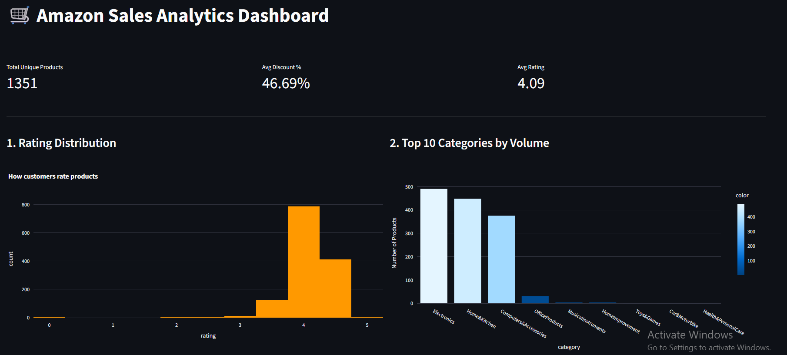
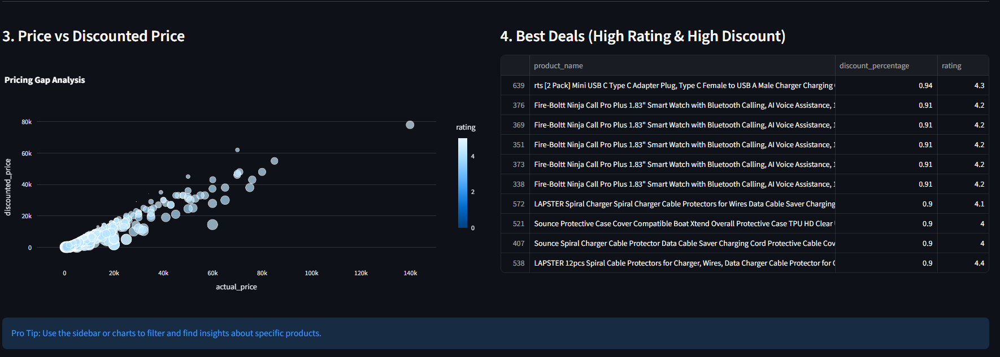

# 🛒 Amazon Sales Data Pipeline (ETL & Analytics)

An end-to-end Data Engineering project that extracts live sales data from Kaggle, transforms it using Python (Pandas), and loads it into a PostgreSQL database. The project concludes with an interactive Streamlit dashboard for business insights.

## 🚀 Project Overview
This project demonstrates a complete **ETL (Extract, Transform, Load)** pipeline designed to handle e-commerce data. It automates the process of gathering raw data, cleaning it to handle currency/types issues, and making it "Analytics-Ready."

## 🏗️ Architecture
The system is built using a modern data stack:
* **Source:** Kaggle API (Amazon Sales Dataset)
* **Orchestration & ETL:** Python 3.11 & Pandas
* **Database:** PostgreSQL (Running via Docker)
* **Visualization:** Streamlit & Plotly


## 🛠️ Key Features
* **Automated Extraction:** Using Kaggle API to fetch the latest dataset versions.
* **Advanced Transformation:** * Currency cleaning (converting ₹ to numeric floats).
    * Deduplication (Removed 114 duplicate product entries).
    * Handling corrupted rating values and missing descriptions.
* **Dockerized Infrastructure:** Database and management tools (pgAdmin) are fully containerized for easy deployment.
* **Interactive Dashboard:** A real-time dashboard to track pricing trends and product performance.

## 📊 Business Insights (Dashboard)
The dashboard provides several key metrics:
1.  **Pricing Analysis:** Visualizing the gap between actual and discounted prices.
2.  **Category Performance:** Identifying which categories offer the highest average discounts.
3.  **Customer Sentiment:** Distribution of ratings across 1,300+ unique products.

> **Note:** Add your dashboard screenshot here!
> 
> 

## 💻 How to Run
1.  **Clone the Repository:**
    ```bash
    git clone [https://github.com/your-username/amazon-sales-project.git](https://github.com/your-username/amazon-sales-project.git)
    ```
2.  **Set up Environment Variables:**
    Create a `.env` file with your `KAGGLE_USERNAME` and `KAGGLE_KEY`.
3.  **Start Infrastructure:**
    ```bash
    docker-compose up -d
    ```
4.  **Run ETL Pipeline:**
    ```bash
    python scripts/etl_script.py
    ```
5.  **Launch Dashboard:**
    ```bash
    streamlit run dashboard.py
    ```

## 📈 Database Schema
The final analytics table `analytics_amazon_sales` includes:
* `product_id` (Unique Key)
* `discounted_price` (Float)
* `actual_price` (Float)
* `discount_percentage` (Float)
* `rating` (Float)
* ...and more.